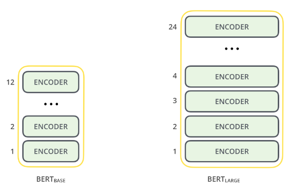
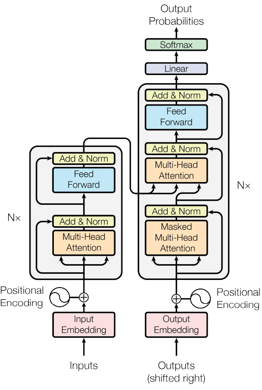
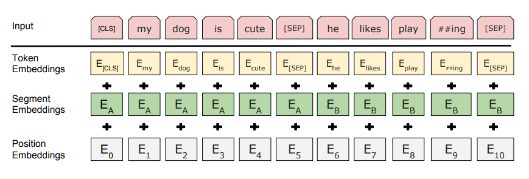
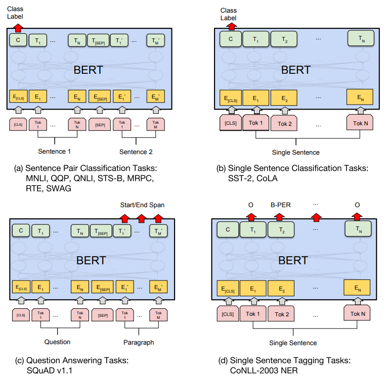

# **NLP Transformers**
> The entire repository encourages the execution of transformer models for NLP related tasks. It covers state-of-art transformers models such as BERT, TF5, etc. To understand the context of this repository, you will require to have an idea on how to implement tokenizers, perform NER, extract POS tags, etc.  

The prime objective of this repository is to build the custom training pipelines which are very modular in nature and if the input is provided in a specific format, the modules available must be able to generate models accordingly. The current scope of framework covers Pytorch for now but could be extended to support other frameworks like tensorflow, etc.

## **Table of Contents**
* [General Information](#general-information)  
  * [BERT Information](#bert-information)  
* [Technologies Used](#technologies-used)
* [Features](#features)
* [Screenshots](#screenshots)
* [Setup](#setup)
* [Dataset Utilized](#dataset-utilized)
* [Usage](#usage)
* [Project Status](#project-status)
* [Room for Improvement](#room-for-improvement)
* [References](#references)
* [Acknowledgements](#acknowledgements)
* [Contact](#contact)
<!-- * [License](#license) -->

## **General Information**
- The prime objective of this repository is to build the custom training pipelines which are very modular in nature and if the input is provided in a specific format, the modules available must be able to generate models accordingly. The current scope of framework covers Pytorch for now but could be extended to support other frameworks like tensorflow, etc.  
- Plan is to extend this behaviour for most of the open source Language architectures which are capable of performing different 
- Make the individual NLP task based modules integratable to NLP Platter. 

### **BERT Information**

####  **What is BERT?**
**BERT** stands for **Bidirectional Encoder Representations from Transformers**. It is designed to pre-train deep bidirectional representations from unlabeled text by jointly conditioning on both left and right context. As a result, the pre-trained BERT model can be fine-tuned with just one additional output layer to create state-of-the-art models for a wide range of NLP tasks.  

**Key takeaways:**  
    1. BERT is based on **Transformer architecture**.  
    2. BERT is pre-trained on large corpus of **unlabelled text** including entire **Wikipedia (around 2500 million words)** and **Book Corpus (around 800 million words)**.  
    3. BERT is **deeply bidirectional model**. Bidirectional means that BERT learns information from both the left and the right side of a token’s context during the training phase.

####  **BERT Architecture**  
It is build on top of Transformers. Currently, there are 2 variants of BERT:  
1. **BERT base:**  
12 layers (transformer blocks), 12 attention heads, and 110 million parameters  
2. **BERT large:**  
24 layers (transformer blocks), 16 attention heads and, 340 million parameters  
    

There are 2 main components of transformer arhcitecture. These are:
1. **Encoder Stack:**  
It is composed of 6 identical encoder layers and each layer has 2 sub layers - **multi-head attention mechanism** and **fully connected feed forward network**. On top of these 2 sub layers, we also have residual + normalization layer. The output from the encoder part is an array of dimensions equal to 512. 
2. **Decoder Stack:**  
It is also composed of 6 identical decoder layers and each layers has 3 sub layers - **multi-head attention mechanism**, **fully connected feed forward network** and **masked multi-head attention mechanism**. Similar to encoders, each layer is also supported by residula + normalization layer

####  **Text-Preprocessing BERT**
The developers behind BERT have added a specific set of rules to represent the input text for the model. Many of these are creative design choices that make the model even better.

For starters, every input embedding is a combination of 3 embeddings:
1. **Position Embeddings:**  
BERT learns and uses positional embeddings to express the position of words in a sentence. These are added to overcome the limitation of Transformer which, unlike an RNN, is not able to capture “sequence” or “order” information
2. **Segment Embeddings:**  
BERT can also take sentence pairs as inputs for tasks (Question-Answering). That’s why it learns a unique embedding for the first and the second sentences to help the model distinguish between them. In the above example, all the tokens marked as EA belong to sentence A (and similarly for EB)
3. **Token Embeddings:**  
These are the embeddings learned for the specific token from the WordPiece token vocabulary
For a given token, its input representation is constructed by summing the corresponding token, segment, and position embeddings. Such a comprehensive embedding scheme contains a lot of useful information for the model.

These combinations of preprocessing steps make BERT so versatile. This implies that without making any major change in the model’s architecture, we can easily train it on multiple kinds of NLP tasks.  

####  **Pre-Training BERT**  
The BERT model is pre-trained on 2 specific tasks:
1. **Masked Language Model (MLM)**  
The masked language model randomly masks some of the tokens from the input, and the objective is to predict the original vocabulary id of the masked word based only on its context. Unlike left-to-right language model pre-training, the MLM objective allows the representation to fuse the left and the right context, which allows us to pre-train a deep bidirectional Transformer.  
In this pre-training task, masking of words was performed however everytime a masking took place, it was not always replaced with a [MASK] token as during fine tuning of this model, [MASK] token would never appear in the training dataset. Ultimately, the BERT researchers used the following methodology to mask random words:
- 80% of the time the words were replaced with the masked token [MASK]  
- 10% of the time the words were replaced with random words  
- 10% of the time the words were left unchanged  

2. **Next Sentence Prediction (NSP)** 
MLM would capture the relevance of next word appearing in any sentence, however it would fail for sentence level. Hence, NSP was performed so that semnatic relationship could also be captured for consecutive sentences.  
In this pre-training task, training dataset having certain no fo sentences were split into pairs of sentences and the BERT researchers used the following methodology in reforming these sentence datasets:  
- For 50% of the pairs, the second sentence would actually be the next sentence to the first sentence  
- For the remaining 50% of the pairs, the second sentence would be a random sentence from the corpus  
- he labels for the first case would be ‘IsNext’ and ‘NotNext’ for the second case  

BERT architecture is completely pre-trained based on unsupervised data and would play a vital role in capturing language relevance and context. This model could be further trained for variety of NLP tasks and the BERT researchers provide a snippet of the same in the reseach paper.  

## **Technologies Used**
- Pytorch  
- Python  

## **Features**
List the ready features here:
- BERT (Bidirectinal Encoder Representation of Transformers):  
  1. Named Entity Recognition (NER) - <mark>**Done**</mark>
  2. Text Classification - <mark>**Done**</mark>  
  3. Sentiment Analysis - <mark>**Done**</mark>  
  4. Text Summarization - <mark>**Done**</mark> 
  5. Question Answering - <mark>**In Progress**</mark>

## **Screenshots**

## **Setup:**
- git clone https://github.com/ManashJKonwar/NLP-Transformers.git (Clone the repository)
- python3 -m venv transformersVenv (Create virtual environment from existing python3)
- activate the "transformersVenv" (Activating the virtual environment)
- pip install -r requirements.txt (Install all required python modules)

## **Dataset Utilized:**
### **BERT Based**
- [Named Entity Recognition](https://www.kaggle.com/datasets/abhinavwalia95/entity-annotated-corpus)  
Annotated Corpus for Named Entity Recognition using GMB(Groningen Meaning Bank) corpus for entity classification with enhanced and popular features by Natural Language Processing applied to the data set.
- [Text Classification](https://www.kaggle.com/datasets/sainijagjit/bbc-dataset)  
Labeled data which classifies news covered in BBC into multiple categories. It consists of 2126 different texts and each one is labelled under 5 categories: entertainment, sport, tech, business, or politics.  
- [Sentiment Analysis](https://www.kaggle.com/datasets/lakshmi25npathi/imdb-dataset-of-50k-movie-reviews)  
IMDB dataset having 50K movie reviews for natural language processing or Text analytics. This is a dataset for binary sentiment classification containing substantially more data than previous benchmark datasets. They provide a set of 25,000 highly polar movie reviews for training and 25,000 for testing. So, predict the number of positive and negative reviews.  
- [Text Summarization](https://www.kaggle.com/datasets/pariza/bbc-news-summary)  
BBC Summary dataset consists of news articles based summaries for 5 categories - business, entertainment, politics, sport and tech. The dataset contains folders segregated into news articles (containing the entire news article in txt format) and summaries (containing the summarized news in txt format). We will try to score each sentence in each articles and decide based on the scoring attained, whether to include as part of summarized text or not.  
- [Question Answering]()  

## **Usage**
### **BERT Based**  
1. Named Entity Recognition (NER):  
    - Training custom NER Model
      > python bert\ner\train.py
  
    - Inferencing custom NER Model  
      > python bert\ner\predict.py

2. Text Classification:  
    - Training custom Text Classification Model
      > python bert\text_classification\train.py

    - Inferencing custom Text Classification Model
      > python bert\text_classification\predict.py  

3. Sentiment Analysis:  
    - Training custom Sentiment Analysis Model
      > python bert\sentiment_analysis\train.py

    - Inferencing custom Sentiment Analysis Model
      > python bert\sentiment_analysis\predict.py  

4. Text Summarization:  
    - Training custom Text Summarization Model
      > python bert\text_summarizer\train.py

    - Inferencing custom Text Summarization Model
      > python bert\text_summarizer\predict.py  

5. Question Answering:  
    - Training custom Question Answering Model
      > python bert\question_answering\train.py

    - Inferencing custom Question Answering Model
      > python bert\question_answering\predict.py  

## **Project Status**
Project is: __in progress_ 

## **Room for Improvement**
Room for improvement:
- Provide support for other deep learning frameworks like tensorflow

## **References**
[1] BERT: Pre-training of Deep Bidirectional Transformers for Language Understanding - Jacob Devlin, Ming-Wei Chang, Kenton Lee, Kristina Toutanova - [Paper Link](https://arxiv.org/pdf/1810.04805.pdf)  
[2] Attention is All you need - Ashish Vaswani, Noam Shazeer, Niki Parmar, Jakob Uszkoreit, Llion Jones, Aidan N. Gomez, Lukasz Kaiser, Illia Polosukhin - [Paper Link](https://arxiv.org/pdf/1706.03762.pdf)

## **Acknowledgements**
- Official code base for BERT - [Link](https://github.com/google-research/bert).

## **Contact**
Created by [@ManashJKonwar](https://github.com/ManashJKonwar) - feel free to contact me!

<!-- Optional -->
<!-- ## License -->
<!-- This project is open source and available under the [... License](). -->

<!-- You don't have to include all sections - just the one's relevant to your project -->